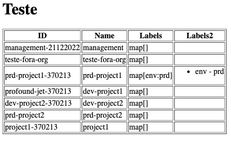

# gptm
Google Project Management

### About

List All projects and some informations: Name, ProjectID, CreateAt, Labels.

### How to use:

`export GCP_API_KEY=$(gcloud auth print-access-token)`

`go run main.go`


### Docker

`docker run -it --rm --name gptm --env GCP_API_KEY=$(gcloud auth print-access-token) -p 8080:8080 tonnytg/gptm:v0.0.1`


### Output:
```
➜  gptm git:(main) ✗ go run main.go
Project: app-engine-01 - 284195978841
CreateAt: 2021-07-18 13:41:45.023 +0000 UTC
Labels:
        teste:valor1
        teste2:valor2
        teste3:valor3
        teste4:valor4
---
Project: My First Project - 899036844948
CreateAt: 2021-06-15 15:38:59.914 +0000 UTC
Labels:
---

```

### Webserver Enabled

`export GCP_API_KEY=$(gcloud auth print-access-token)`

`go run main.go --webserver enabled`


This command will create a webserver on port 8080




<br/>
Have fun!<br/>
But if you liked!
<br/>

[Pay me a Coffee!](https://www.paypal.com/invoice/p/#LRG2ZNMKF8T5R6K2)

<br/>
<br/>
NuBank PIX!!!<br/>
